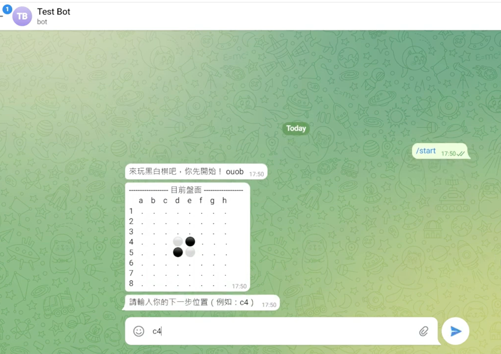
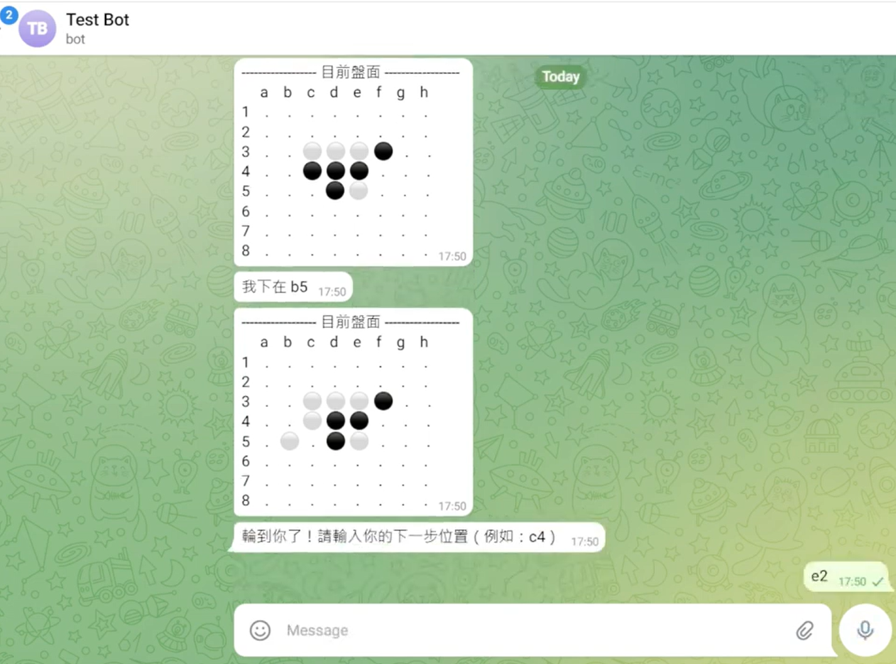
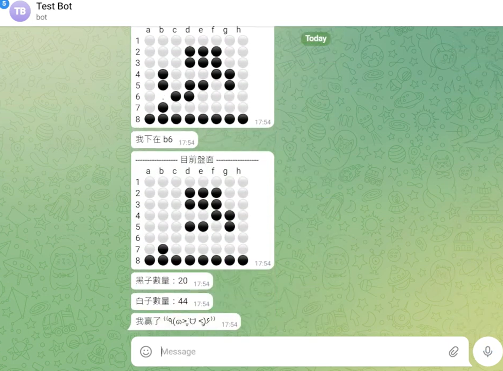

# Telegram Reversi Bot

A playable Reversi (Othello) game implemented as a Telegram bot using Python and the Telegram Bot API.

This project demonstrates chatbot development, conversation management, state handling, and automated user interactions within Telegram.

## Overview

Telegram Reversi Bot allows users to play a complete game of Reversi directly through Telegram chat.

The bot manages:

* Game initialization
* Turn-based gameplay
* Move validation
* Board state updates
* AI opponent moves
* Score calculation
* Winner announcement

This project was built as a demonstration of Telegram bot development and conversational application design.

---

## Demo

### Start a New Game

Users can start a game directly with the `/start` command.



### Turn-Based Gameplay

The bot validates moves, updates the board, performs AI actions, and returns the latest game state.



### Automatic Result Calculation

At the end of the match, the bot calculates scores and announces the winner automatically.



---

## Features

### Telegram Bot Integration

* Telegram Bot API integration
* Command handling
* Chat-based user interaction

### Reversi Game Engine

* Standard 8×8 board
* Legal move validation
* Piece flipping logic
* Turn management
* Score calculation

### Automated Opponent

* AI opponent
* Automatic move generation
* Game progression management

### Conversation Workflow

* Stateful gameplay sessions
* Input validation
* User-friendly prompts and responses

---

## What This Project Demonstrates

This project showcases skills commonly used in chatbot and automation projects:

* Telegram Bot API
* Python backend development
* Stateful applications
* Conversation management
* User interaction workflows
* Automated response systems
* Business logic implementation

---

## Technology Stack

* Python
* Telegram Bot API
* python-telegram-bot

---

## Project Structure

| File                    | Description                      |
| ----------------------- | -------------------------------- |
| `main.py`               | Main Telegram bot application    |
| `2dgame.py`             | Core Reversi game logic          |
| `button_basic.py`       | Inline keyboard prototype        |
| `conv.py`               | Conversation handler experiments |
| `bot_secret.example.py` | Example configuration file       |

---

## Setup

```bash
python -m venv venv

# Windows
venv\Scripts\activate

pip install -r requirements.txt

set TELEGRAM_BOT_TOKEN=your_bot_token

python main.py
```

## Security

The repository does not contain any real Telegram bot tokens.

Credentials are loaded through environment variables following standard security practices.

---

## Future Improvements

* Human vs Human mode
* Stronger AI opponent
* Persistent game saves
* Inline button board controls
* Match history
* User ranking system

---

## Author

Hsiu-Ting Su

National Yang Ming Chiao Tung University (NYCU)

Interests:

* Chatbot Development
* AI Applications
* Automation Systems
* Human-Computer Interaction
* Embedded Systems

